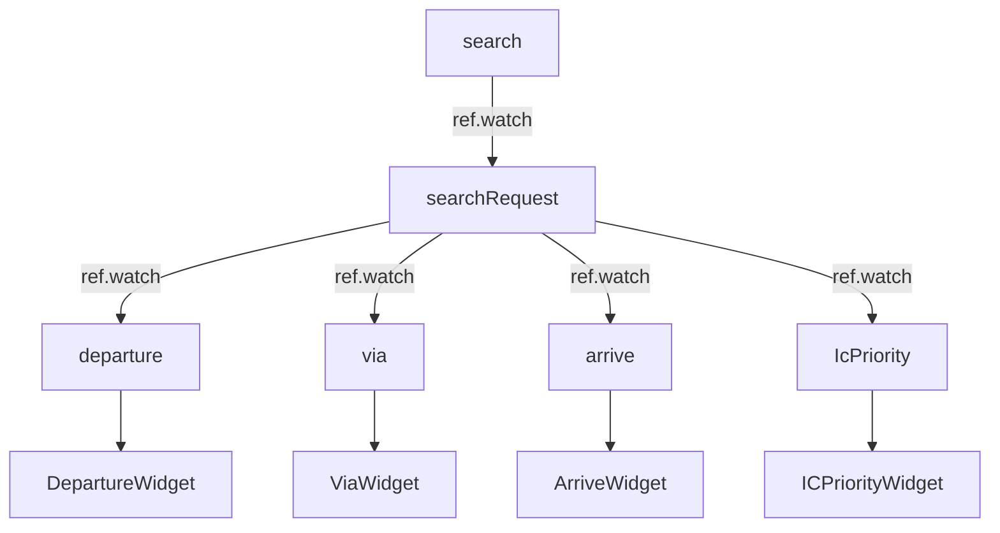
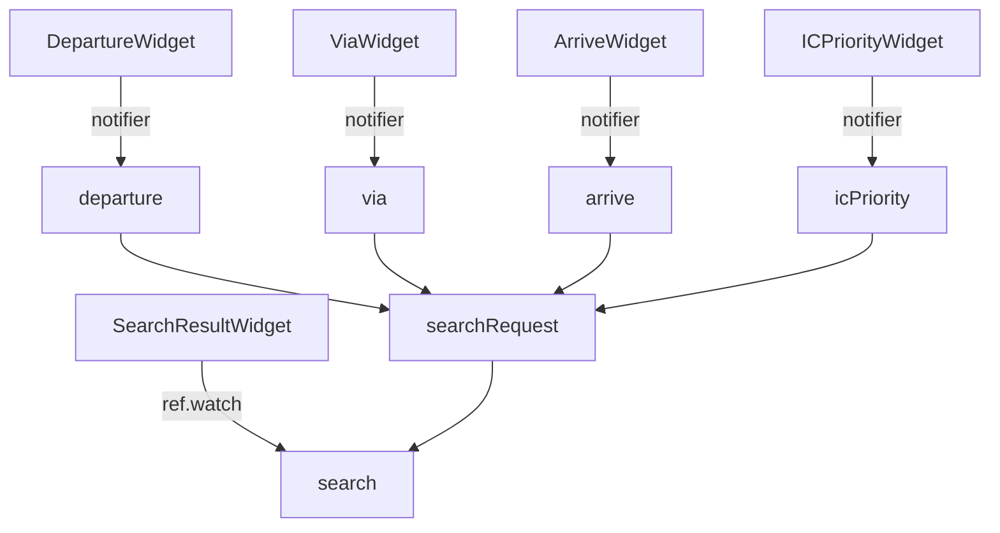

## View層が存在しないFlutterアーキテクチャ

これまでのMVVMパターンには、ViewがViewModelの投影を自発的に行う必要がありました。

たとえばKotlinの例では、`FragmentMainBinding.inflate`がこれに当てはまります。Bindingが生成したViewに対して直接操作することも可能です。

```kotlin
class MainFragment : Fragment() {
    private var _binding: FragmentMainBinding? = null
    private val binding get() = _binding!!

    override fun onCreateView(
        inflater: LayoutInflater, container: ViewGroup?,
        savedInstanceState: Bundle?
    ): View {
        _binding = FragmentMainBinding.inflate(inflater, container, false)
        return binding.root
    }

    override fun onViewCreated(view: View, savedInstanceState: Bundle?) {
        super.onViewCreated(view, savedInstanceState)
        binding.button.setOnClickListener {
            binding.textView.text = "ボタンが押されました"
        }
    }

    override fun onDestroyView() {
        super.onDestroyView()
        _binding = null
    }
}
```

原理的にViewとはこのような層を指していました。たとえ双方向バインディングを用いていたとしても、このようにViewを直接操作する構文を完全に廃し切ることもなければ、そもそもBindingをViewに紐づけるという行為そのものがViewの責務として存在していました。

まして、双方向バインディングのないViewとは、あるいはViewModelもないViewとは、状態とViewが密結合した混沌とすらいえたでしょう。

では、Flutterの場合はViewはどこにあたるのでしょうか？また、Viewとはどうやって操作するのでしょうか？

これまでの解説から基づけば、そもそもViewを操作するという概念自体がありえないのですね。殊にFlutterにおいては、真にViewたり得るのはSkiaやImpellerを介して描画を命令的に実行する層で、これはFlutterのエンジンの奥深くの箇所になるでしょう。つまりViewというものはそもそも存在しえないのです。

ウィジェットはUIツリーを構造的に表現しているだけでしかなく、これを直接操作することもできません。なので、もしFlutterを用いたアプリの設計書に「ボタンを押したらラベルを赤くする」という表現があったとすれば、これは「ステークホルダーに説明するための本質的な仔細を省いた表現」か、「Flutterの本質的理解が無い者が書いた表現」のどれかになります。文字通りに「ラベルが主体的に自分から赤くなる」ことは不可能ですし、そのような操作は許されていないからです。これがViewというものが存在しない、という点の本質的な面です。

これはもちろんViewを直接操作する層はImpellerやSkiaに対して命令する層であることもそうですが、ウィジェットが定義された状態に対して不可逆であるという点もあります。もしこのように直接操作する層は隠蔽されていたとしても、ウィジェットツリーを誰かが直接操作する手段があったりすれば、先程のようにラベルを赤くするということはできるかもしれません。

ここではそのようなことが可能か具体的に見ていきましょう。

### RenderObjectとKeyからTextウィジェットを導出し、Textウィジェットを直接操作しようとする例

Flutterでは、ウィジェットは宣言的に構築され、`Key`はウィジェットの同一性を保つために使われます。`RenderObject`はウィジェットツリーの下層で実際の描画やレイアウトを担当しますが、通常は直接操作しません。しかし、Flutterの仕組みを深く理解するために、`RenderObject`と`Key`を使って`Text`ウィジェットを導出し、さらにTextウィジェットを直接操作しようとする例を示します。

まず、`GlobalKey`を使って`Text`ウィジェットの`State`や`RenderObject`にアクセスしようとするコード例です。

```dart
import 'package:flutter/material.dart';

void main() => runApp(const MyApp());

class MyApp extends StatelessWidget {
    const MyApp({super.key});

    @override
    Widget build(BuildContext context) {
        return const MaterialApp(
            home: Scaffold(
                body: Center(child: TextManipulator()),
            ),
        );
    }
}

class TextManipulator extends StatefulWidget {
    const TextManipulator({super.key});

    @override
    State<TextManipulator> createState() => _TextManipulatorState();
}

class _TextManipulatorState extends State<TextManipulator> {
    final GlobalKey textKey = GlobalKey();
    String text = "初期テキスト";

    void _tryDirectManipulation() {
        // Textウィジェット自体やそのRenderObjectを取得
        final context = textKey.currentContext;
        final renderObject = context?.findRenderObject();

        // Textウィジェットのインスタンス取得（ただしStatelessWidgetなので状態は持たない）
        final widget = context?.widget;
        debugPrint('widget: $widget');
        debugPrint('renderObject: $renderObject');

        // Textウィジェットの内容を直接変更しようとしてもできない
        // widget.text = "変更"; // これはエラーになる

        // RenderObjectを直接操作しても、Textの内容は変わらない
        // renderObject?.someProperty = ...; // そもそもTextの内容はRenderObjectに持たせていない
    }

    @override
    Widget build(BuildContext context) {
        return Column(
            mainAxisAlignment: MainAxisAlignment.center,
            children: [
                Text(text, key: textKey),
                ElevatedButton(
                    onPressed: () {
                        _tryDirectManipulation();
                        setState(() {
                            text = "ボタンで変更";
                        });
                    },
                    child: const Text("直接操作を試みる"),
                ),
            ],
        );
    }
}
```

この例では、`GlobalKey`を使って`Text`ウィジェットの`BuildContext`や`RenderObject`にアクセスしようとしています。しかし、`Text`ウィジェットは`StatelessWidget`であり、状態や内容を直接変更することはできません。また、`RenderObject`も`Text`の内容自体は保持していません。

このような方法をもってしても明示的にViewを操作する、ウィジェット層を操作するという方法は許されていないことからも、「ボタンを押したらラベルを赤くする」という表現がFlutterに対していかに本質的でないか、そもそも不可能なことを要求しているかが分かるでしょう。

そう、常に状態が介在しなければならないのです。「ボタンを押したらボタンフラグの状態がtrueになる、ボタンフラグの状態がtrueになったからテキストは赤く表現される」と書かれていなければ、字義通りの実装は不可能だということです。

つまり、Flutterにおける設計とは、状態と、状態に伴う画面の組み合わせです。もしも詳細設計書があるとすれば、状態と、状態に対応した画面の構成が網羅されていなければなりません。

## Flutterが完全に宣言的でもない理由

Flutterにおいては、`showDialog`や`showSnackBar`といった**命令的**にUIを操作する方法がいくつかあります。あるいは、`Controller`という形で状態の変更を許すものがあります。

たとえば`showDialog`であれば、必ずしも`showDialog`を使わなくてもダイアログを表示することはできます。

```dart
class ModalWithChild extends HookWidget {
    final Widget child;
    final bool isDisplay;
    final void Function() onAction;

    const ModalWithChild({
        Key? key,
        required this.child,
        required this.isDisplay,
        required this.onAction,
    }) : super(key: key);

    @override
    Widget build(BuildContext context) {
        return Stack(
            children: [
                child,
                if(isDisplay)
                    AlertDialog(
                        content: Text('メッセージです'),
                        actions: [
                            TextButton(
                                onPressed: onAction,
                                child: const Text('OK'),
                            ),
                        ],
                    ),
            ],
        );
    }
}
```

このようにして、このウィジェットがMaterialAppの下とかにいれば、ダイアログを自身が管理する状態に従属させて表示させたりさせなかったりすることができます。状態を下から上にどうやって伝播させるかという話であれば、それこそRiverpodでDialogStateNotifierのようなものを作ればよいでしょう。

この方法であれば、ダイアログは状態に従属し、さらにダイアログの操作は非同期処理としてCompleterを用いればNotifier側に返せるため、実際にビジネスロジックとダイアログが密接に関係する場合においては有効な手段です。これはダイアログにかかわらず、BottomModalSheetのようなものにも使えるでしょう。[1]

さらにビジネスロジックとUIが分離するため、テストも行いやすくなります。これだけ聞けばこちらのほうがよいのではないか？と思えてきます。

実際にダイアログの表示待ちという非同期処理がビジネスロジックと頻繁に結びつくケースでは、このように命令的なAPIを使わずに宣言的、純粋関数的思考で`showDialog`を使わないことという選択肢があるわけです。では、他の命令的APIも、極論的にいえばすべてこのように宣言的にできないのでしょうか？

[1]: 拙作のアプリ [dialog_state.dart](https://github.com/shiosyakeyakini-info/miria/blob/develop/lib/view/common/dialog/dialog_state.dart) と [dialog_scope.dart](https://github.com/shiosyakeyakini-info/miria/blob/develop/lib/view/common/dialog/dialog_scope.dart) において使用している方法です

理論上は、引数以外の状態に依存せず、引数以外の状態を変更しないということは可能です。先ほどのダイアログの例もそうですし、

たとえば、

```dart
Widget buildTextField(TextFieldState state, void Function(TextFieldState) onChange) {
  return CustomTextFieldLikeWidget(
    text: state.text,
    selection: state.selection,
    composing: state.composing,
    onTextChanged: onChange,
  );
}

Widget buildAnimation(Duration elapsedTime) {
  final progress = min(1.0, elapsedTime.inMilliseconds / totalDuration.inMilliseconds);
  return SomeAnimatedWidget(progress: progress);
}
```

のように、`TextEditingController`や`AnimationController`の状態もすべて宣言的に記述させることは、理屈の上では可能です。しかしこれは現実的でしょうか？

上記のように、ダイアログはJetpack Composeもそうしているように、自身が管理する状態を正として、UIは状態写像の射影であるというのをそのまま体現するような使い方も可能です。これはそもそもダイアログのみならず、ナビゲーション全般がそうであるかもしれません。

しかし、特にFlutterが`Controller`として提供する命令的APIは、性能面をも重視したより現実的な理由によるものです。AnimationControllerはフレーム毎にアニメーションを行うことが必要ですが、もし状態を正としてフレーム毎にウィジェットツリーの再ビルドを要求すると、性能面での劣化を招きえます。また、TextEditingControllerはOSのIMEと統合される都合上、宣言的操作によって記述することが現実的に困難といえます。

これらの理由から、ウィジェットの状態を必ずしも引数として入力してそれを射影するだけでなく、Controllerという形での操作もできるようにしているのだともいえます。FocusNodeなどについても同じことがいえるでしょう。

`showDialog`もそうで、実際にはNavigatorが行っているパスとのルーティング管理や遷移アニメーションといったものが上記の例では省かれています。そうしたものもすべて自前で行うには負荷が高いうえに、簡単にダイアログを出したいという要件はやはりよく起きるので、このような形 --- ModalRouteというルーティングによるダイアログの簡単な遷移方法が用意されているのだろうといえます。

上記の状態に従属するダイアログは、複雑なビジネスロジックとダイアログの操作待ちが結びつくケースでは有効ですが、簡単かつ迅速にアプリを作る方法としてはオーバースペックです。ただ、アプリがスケールすると複雑なビジネスロジックとダイアログ操作の結合は、必要になる場面も来るかもしれません（経験則的にはわりとよく来ます）。

Flutterは純粋関数潔癖症ではないので、いくつかの命令的動作を残すことによって、開発者がより速く、より簡単に実装できるようにしながら、それでいて宣言型UIとして基本的には宣言的に記述させることを目指しているといえるでしょう。

## クリーンアーキテクチャとRiverpod

ところで、クリーンアーキテクチャとRiverpodとはどうなのでしょうか。

クリーンアーキテクチャで重要なのは、依存の方向性の統一であり、その仔細ではありません。UseCaseとかPresenterとか、たまたま例示されていた責務分離方法を崇め奉ることは本義ではなく、ViewModelやControllerのどれを用いるかという具体についてもクリーンアーキテクチャそのものが示すことはありません。クリーンアーキテクチャの思想は、本質的には

- 機能の責務と分離
- 依存関係の単方向化

の2点に限られます。

であれば、たとえ原子化された状態モデルであったとしても、





のように状態の依存方向が単一方向で、またnotifierによる操作も逆の単一方向であれば、それは**どれがUseCaseだとかPresenterとかRepositoryとかいう議論は無きにして、クリーンアーキテクチャだといえます**。


この関係がどこかで破綻すれば、Riverpodの依存関係のグラフ構築が循環参照を起こしては再帰に走ってスタックオーバーフローしたりしてしまいます。これこそが本質的にクリーンアーキテクチャでなくなった瞬間です。

もしViewModel的にRiverpodを用いた場合でも、それはやはりクリーンアーキテクチャたりえます。なぜなら依存関係だけで見ればよりシンプルな関係性となるからです。


FlutterがViewを持たないという議論も本質的なクリーンアーキテクチャ観点からはどうでしょうか。最終的にウィジェットツリーから画面に直接描画する機構は単方向であり、依存の逆転を起こす方法を持っていないわけですから、この点にあってもやはりクリーンアーキテクチャ的であるといえます。

ということで、FlutterとRiverpodを使う以上は状態の流れを単一方向にせざるをえず、自然にクリーンアーキテクチャになりえるということです。


## RiverpodがFlutter界の状態管理デファクトスタンダード担った理由を考える

これまで見てきた通り、Riverpodは

- Jotai/Recoil的「形式的原子性」を追求する
- Pinia的 意味論毎の「ストア管理」に舵を切る
- 従来のMVVMへそのまま移行するためにViewModel的に設計する

このどれもがRiverpodで実現することができますし、Riverpodはこのどれかを強要しているわけでもありません。

コンポーネントや状態に対する「原子性」を理論的な最小単位まで分解してそれに基づいてProviderを設計することも、極端な原子性は認知負荷が高すぎるから意味論的集合に留めた単位でProviderを設計することも、既存のAndroidのMVVMパターンからそのまま容易に移行するためにそのMVVMのモデルを移植し、部分的に分割していくことも、どれもRiverpodでは「可能」です。

さらに、Scoped Providerを用いてウィジェットツリーをスコープとした、InheritedWidgetや旧来の「Provider」パッケージの概念を再評価することもできます。

このような柔軟性がRiverpodがデファクトスタンダードたりえる理由の最も大きな点だと考えられます。しかし、それはまた罪でもあるでしょう。

なぜなら、初学者はどうやってProviderの関係や責務単位を設計すればよいか迷いますし、熟練者でもReactの背景を持たない人々しかいない世界ではRiverpodに状態の原子性を見出すこともまた難しいかもしれません。そして多くの従来のスマホアプリ開発者のうち、特にJetpack ComposeやSwift UIの状態管理理論を知らない人々、あるいはJetpack ComposeのViewModelに倒錯的疑問を抱かない人々は、StateNotifierをそのままViewModelと誤認してしまうかもしれません。

これは、Riverpodが柔軟であるが故の罪、そう感じられます。汎用的に用いられるが故に、Providerの責務単位にぶれが生じさせうることは、メリットにもデメリットにもなりえます。

## まとめ

本章では、Flutterにおける「View層の不在」の原則と宣言的UIの本質、そしてRiverpodによる状態管理の柔軟性について解説しました。

Flutterでは従来のMVVMやMVCのような「Viewを直接操作する」発想が通用せず、状態とUIの射影という構造が根本的な設計思想となっています。しかしその一方で、状態を命令的に変更する手段を完全に廃したわけでもなく、折衷によって成り立っていることを解説してきました。

また、Riverpodは状態管理の粒度や責務分割においてMVVM的な粒度も許していれば、原子的状態管理のアプローチを許容しており、その柔軟性がデファクトスタンダードとなった理由でもあります。一方で、柔軟すぎるがゆえに設計指針が曖昧になりやすいという課題も存在します。

結局のところ、どうすればよいかという点にあっては、

- Flutterの宣言的原則と、その中にある命令的所作の矛盾とうまく付き合いながら宣言的に記述する
- RiverpodはViewModelを禁じる訳では無いが、その機能責務の集中は避けるべきで、粒度を画面に縛られる必要もないので、あくまでそれは機能に対して行われるべき
- 最終的にProviderの粒度の細分化を突き詰めれば、Recoil/Jotaiが目指すような原始的状態管理に帰結します。
- クリーンアーキテクチャはその本義に立ち返る必要があり、たまたま例示されていた表面的なUseCaseとかPresenterに囚われる必要がありません。Riverpod的な依存関係構築を適切に整理できれば、それは自然にクリーンアーキテクチャとなります。